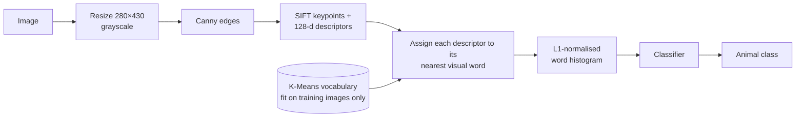
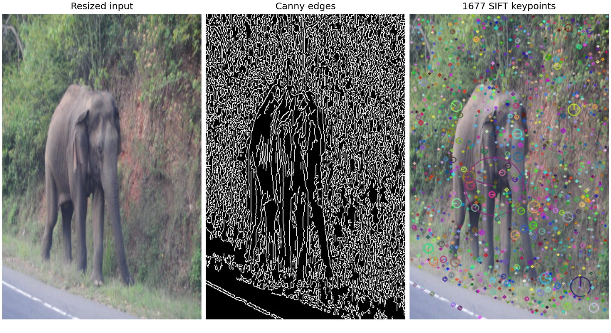

# Animal Image Classification with SIFT and Bag of Visual Words


A classical computer-vision pipeline that classifies animal photos using **no deep learning**. It uses
Canny edge detection, SIFT local descriptors, a **K-Means visual vocabulary (Bag of Visual Words)**,
and standard machine-learning classifiers: logistic regression, decision tree, random forest, and
linear and RBF SVMs.

## Pipeline



1. **Preprocessing:** every image is resized to 280×430 and converted to grayscale. Canny edge
   detection (thresholds 30/100) keeps the shape structure and drops texture and colour.
2. **Local features:** SIFT detects scale- and rotation-invariant keypoints on the edge map and
   describes each one with a 128-dimensional vector.
3. **Visual vocabulary:** K-Means groups the training descriptors into *k* clusters, the "visual
   words". One vocabulary is shared by all classes, and it is learned from training images only and
   without labels.
4. **Encoding:** each image becomes a *k*-bin histogram of how often each visual word appears,
   normalised so images with many or few keypoints are comparable.
5. **Classification:** several classifiers are trained on the training histograms and compared on
   a held-out test set. The pipeline can compare several vocabulary sizes (e.g. 17, 50, 100, 200)
   in one run.

<p align="center"><br>
<em>A test image from the dataset after each step (generated with <code>reporting.plot_pipeline_example</code>).</em></p>

## Repository structure

```
├── src/animal_bovw/
│   ├── config.py          # experiment configuration
│   ├── data.py            # class-folder dataset discovery, train/test splits
│   ├── features.py        # preprocessing (resize, grayscale, Canny) and SIFT extraction
│   ├── vocabulary.py      # BagOfVisualWords: K-Means codebook + histogram encoding
│   ├── classifiers.py     # the compared scikit-learn models
│   ├── model.py           # AnimalClassifier: end-to-end image -> label model (save / load)
│   └── reporting.py       # metrics, tables and figures
├── scripts/
│   ├── run_benchmark.py   # extract features, sweep vocabulary sizes, compare classifiers
│   └── predict.py         # classify new images with a saved model
├── tests/                 # unit and end-to-end tests on synthetic images
├── docs/                  # figures used in this README
└── notebooks/             # original exploratory notebook (see note below)
```

## Getting started

```bash
git clone https://github.com/walekarkaran/Animal-Classification-SIFT-KMeans.git
cd Animal-Classification-SIFT-KMeans
python -m venv .venv && source .venv/bin/activate
pip install -e ".[dev]"
```

### Data

Put the images in one folder per class. Separate `train/` and `test/` splits are used when present;
otherwise a stratified 80/20 split is made. Nested folders inside a class (e.g. `Label/` annotation
folders) are ignored.

```
data/animals/
├── train/
│   ├── Bull/  *.jpg
│   ├── Cattle/
│   └── ...
└── test/
    ├── Bull/
    └── ...
```

The original experiments used nine classes of Open Images photos: Bull, Cattle, Elephant, Horse,
Leopard, Monkey, Pig, Rabbit and Sheep. That training set had 2,069 images and was strongly
imbalanced (Monkey 770, Horse 400 … Bull 47), so **macro F1 and the majority-class baseline are
reported alongside accuracy**.

### Run

```bash
# compare all classifiers at several vocabulary sizes
python scripts/run_benchmark.py --data-root data/animals --vocab-sizes 17 50 100 200

# SIFT on grayscale instead of Canny edges
python scripts/run_benchmark.py --data-root data/animals --no-canny

# classify new images with the best saved model
python scripts/predict.py --model outputs/run-<timestamp>/best_model.joblib --images my_photo.jpg
```

Each run writes to `outputs/run-<timestamp>/`:
- `summary.csv`: train and test accuracy plus macro precision, recall and F1 for every classifier at
  every vocabulary size
- the best model as a single `.joblib` file, which handles preprocessing, SIFT, the vocabulary and the
  classifier
- the best model's classification report
- figures: classifier comparison against the majority-class baseline, normalised confusion matrix,
  pipeline visualisation
- a log file

### Tests

```bash
pytest
```

The tests check dataset discovery, preprocessing and SIFT output, histogram normalisation (every
visual word gets its own bin), behaviour on images with no keypoints, and an end-to-end train → save →
load → predict round trip on synthetic images.

## Results

Valid results for this pipeline are pending a run on the image dataset with
`scripts/run_benchmark.py`. The accuracy figures printed in the original notebook should **not** be
used; see the next section for why.

## About the original notebook

[`notebooks/animal_classification_sift_kmeans.ipynb`](notebooks/) is the original 2024 coursework
notebook, kept for reference. It reported 97.9–98.6% test accuracy, but its evaluation was not valid:

- **Label leakage.** A separate K-Means vocabulary was trained for each class, and each image was
  encoded with its *own* class's vocabulary. The features therefore carried the label, and the
  approach cannot classify an image whose class is unknown. This is why the notebook's single-image
  demo predicts an elephant as "Sheep"/"Pig".
- **Class-dependent preprocessing.** Bull images were encoded from Canny edges and the other eight
  classes from grayscale images, which is another signal correlated with the label.
- **Duplicated rows.** Feature CSVs were written in append mode, so the final table held 4,138 rows
  for 2,069 images, and copies of the same images could appear in both train and test.
- **Smaller bugs.** The histogram bins listed `12` twice, so one visual word was always empty. The
  demo function histogrammed raw pixel values instead of visual words, and its labels were shifted
  by one. Metrics were also called with arguments swapped (`metric(pred, true)`).

This repository's implementation fixes all of these: one shared vocabulary learned without labels,
identical preprocessing for every image, a held-out test set, and one saved model used for both
evaluation and prediction.

## Limitations and possible extensions

- Most keypoints fall on cluttered background such as vegetation rather than the animal (see the figure
  above), so the histograms partly describe the scene. Cropping to the animal (when bounding boxes are
  available) or filtering keypoints would help.
- The fixed 280×430 resize distorts landscape photos; resizing while keeping the aspect ratio would avoid this.
- Bag of Visual Words discards spatial layout; spatial pyramid matching would add it back.
- Hard assignment to a small vocabulary is coarse; soft assignment, VLAD or Fisher vectors usually help.
- Canny edges remove colour and texture, which help distinguish animals such as leopards. Try
  `--no-canny`, or add colour histograms.
- Pretrained CNN features would be the natural modern baseline to compare against.

## License

Code released under the [MIT License](LICENSE). © 2026 Karan Walekar. Images in the dataset remain
subject to their original licences.
